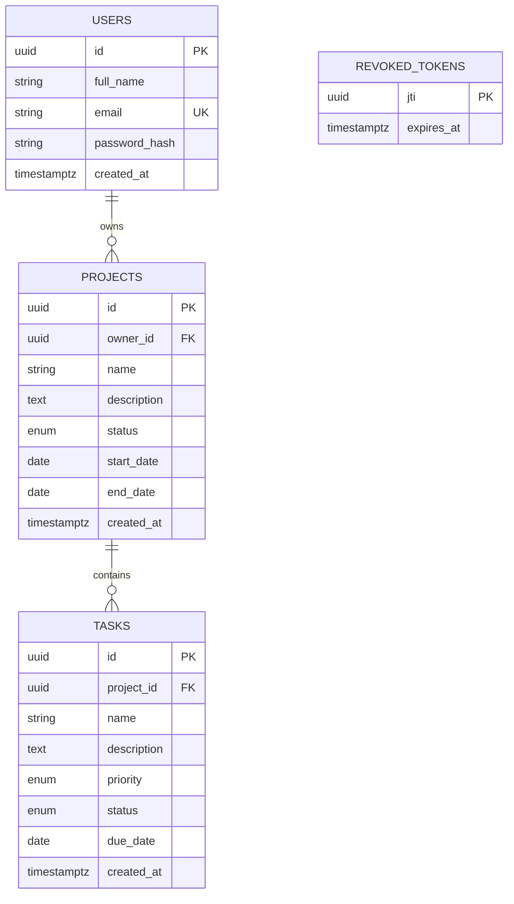

# PLANNING.md — TaskFlow Project Management System (Web + Mobile)

> Source of truth for architecture, goals, style and constraints.
> Read this at the start of every new conversation. Work items live in `TASK.md`. Agent rules live in `AGENTS.md`.
> Last updated: 2026-10-08

Latest presentation correction (2026-10-08): user rejected the pink/peach appearance. Use light warm stone backgrounds, ivory surfaces, navy actions and muted teal accents on both clients. Keep restrained animations, reduced-motion support, existing workflows and native tab symbols. This supersedes the terracotta/peach palette below.

UI decision (2026-10-08, updated by user request): retain Jira-inspired web Kanban columns and phone-friendly mobile status tabs, but replace the dark/yellow presentation with warm light cream surfaces, terracotta accents and sage completion colors. Add restrained entrance/interaction animations with reduced-motion support on both clients. Preserve existing enum values, single-user ownership and shared endpoints. Drag-and-drop and admin/member roles remain outside this redesign. Historical dark-theme references below describe earlier decisions.

Implementation checkpoint (2026-10-08): the PostgreSQL migration, shared API,
Next.js client and Expo client are implemented. Render serves the current API;
the EAS Android build and actual device checks remain pending. Phase 8 documents
the implemented contract, with public Swagger UI at /api/docs/ on dev. Section 2
below preserves the original pre-migration audit, not the current deployed state.

---

## 1. Goal

Deliver the **Full Stack Developer intern task**: a Project Management System with a **web app** and an **Android mobile app** that share **one backend and one database**. A user registers or logs in on either platform and sees and manages the same projects and tasks.

### Deliverables checklist (from the task PDF)
1. Public GitHub repo (one repo is fine)
2. DB schema / ER diagram
3. API documentation
4. README (setup for backend, web, mobile; env vars; DB setup; running mobile against deployed backend)
5. Deployment URLs (web + backend)
6. Android APK or Expo / Firebase App Distribution link
7. 5-minute screen recording: log in with the same account on web and mobile, create a task on one, show it on the other

### Evaluation emphasis
- Security (explicitly "important"), readability, maintainability, good engineering practice
- Must be able to **explain every design decision** in the review session
- Test data only. No real personal data.

---

## 2. Current State (audit of `Keshav-k-Sharma/taskFlow`)

The repo already contains a working **role-based team task portal**. It is a different product from the one the task asks for, so it needs a migration, not just additions.

### 2.1 What exists

| Layer | Current |
|---|---|
| Backend | Node.js, **Express 5.2**, CommonJS, `src/{config,controllers,middleware,models,routes}` |
| DB | **MongoDB** via **Mongoose 9** |
| Auth | `bcryptjs` (cost 10), `jsonwebtoken` (7d), `protect` + `adminonly` middleware |
| Web | **Next.js 16.1 (App Router)**, React 19.2, **plain JS**, axios, React Compiler on |
| Styling | Tailwind v4 installed but **UI is built with inline styles** (dark theme, yellow `#f5e642` accent) |
| Hosting | Web on Vercel (`taskflow26.vercel.app`); backend has `vercel.json` (`@vercel/node`) |
| Mobile | **None** |
| Tests / Docker / CI | **None** |

Existing web pages: `/login`, `/register`, `/dashboard`, `/projects`, `/projects/add`, `/tasks`, `/tasks/add`, `/members`.
Existing components: `navbar`, `taskCard`, `taskList`, `memberCard`, `memberGroup`.

### 2.2 Gap analysis against the task

| Requirement | Status | Detail |
|---|---|---|
| PostgreSQL or MySQL | ❌ | Uses MongoDB. **Not allowed by the task.** Migration required. |
| Users own their own data | ❌ | `GET /projects` and `GET /tasks` return **every user's** data. No ownership checks anywhere. |
| Registration safety | ❌ | `register` accepts `role` from the request body, so anyone can self-register as `admin`. |
| Unique email | ⚠️ | Checked in code only. No unique index on `User.email` (race condition). |
| Auth endpoints | ⚠️ | Has register, login. **Missing** `POST /logout`, `GET /me`. |
| Project CRUD | ⚠️ | Has list, create. **Missing** get-by-id, `PUT`, `DELETE`. Status enum is `active/completed`, should be 3 values. Uses `deadline` instead of start/end dates. |
| Task CRUD | ⚠️ | Has list, create, `PATCH /:id/status`. **Missing** get-by-id, `PUT`, `DELETE`. No priority, no `In Progress`. Task requires `assignedTo`, which the spec doesn't have. Task→project link is optional, spec needs it mandatory. |
| Dashboard endpoint | ❌ | No `/api/dashboard`. Web computes counts client-side and shows *Members*, not the 5 required stats. |
| Search / filter | ⚠️ | Only a client-side status filter on tasks. No search, no priority or project filters, nothing server-side. |
| Input validation | ❌ | None on the backend. |
| Error handling | ⚠️ | `try/catch` per handler. JWT failure returns **500** (should be 401). No central error middleware. |
| Logging | ❌ | `console.log` only. |
| Rate limiting | ❌ | None. |
| CORS | ⚠️ | Allowlist exists but is hardcoded. Must also work for mobile (no `Origin` header, already allowed). |
| Security headers | ❌ | No `helmet`. |
| Token storage (web) | ⚠️ | `localStorage`. Acceptable for the task, but note the XSS tradeoff in the README. |
| Token expiry handling | ❌ | No interceptor. Expired token leaves the user on a broken page. |
| Responsive / validation / loading / error UX (web) | ⚠️ | Pages exist, but with no form validation, no loading or error states, and fixed 3-column grids. |
| Mobile app | ❌ | Not started. |
| Docs | ⚠️ | README is auto-generated and **inaccurate** (claims TypeScript, `.env.example`, `tailwind.config.js`, `server.js`, `/api/users/*` routes that don't exist). Must be rewritten. |

### 2.3 Other issues spotted in code
- `NEXT_PUBLIC_API_URL` is what the code reads, but the README documents `NEXT_PUBLIC_API_BASE_URL`.
- `config/db.js` calls `dns.setServers(["8.8.8.8","1.1.1.1"])` (an Atlas SRV workaround). Remove with Mongo.
- `index.js` calls `app.listen()` **and** `module.exports = app`. Split `app.js` (export) from `server.js` (listen) so tests can import the app.
- `ref: "user"` / model name `"tasks"` are inconsistent. Disappears with the migration.
- `removeMemberFromProject` pulls by subdocument `_id` while the body field is called `memberId` (confusing).
- Mixed `snake`/`camel`/`PascalCase` handler names (`getAlltasks`, `CreateTask`, `adminonly`).

### 2.4 What to keep
- Express 5 (async errors reach the error handler automatically, so no per-handler `try/catch`)
- `bcryptjs`, `jsonwebtoken`, `cors`, `dotenv`
- Next.js App Router + axios + the `lib/api.js` interceptor idea
- Folder layout `controllers / routes / middleware` (add `services`, `validators`, `utils`)
- Navbar / TaskCard / TaskList as starting points (restyle with Tailwind)
- Dark theme and brand (TaskFlow, yellow accent)

### 2.5 What to retire
- Mongoose, `models/*.js`, `config/db.js` DNS hack
- **Members** feature (`Member` model, `/api/members`, `/members` page, `memberCard`, `memberGroup`). Not in the task.
- **`adminonly` / `role`** (not in the task). RBAC is a *bonus*, so re-introduce later only if time allows, done properly.
- `PATCH /:id/status`, `/members`, `/removeMember`, `/memberPosition` routes

---

## 3. Target Architecture

```
            ┌──────────────┐        ┌───────────────────┐
            │  Next.js Web │        │ React Native/Expo │
            │  (Vercel)    │        │   Android app     │
            └──────┬───────┘        └─────────┬─────────┘
                   │  HTTPS + JWT (Bearer)    │
                   └────────────┬─────────────┘
                                ▼
                    ┌───────────────────────┐
                    │ Express 5 REST API    │  helmet · cors · rate-limit
                    │ /api/*                │  zod validation · pino logs
                    └───────────┬───────────┘
                                │ Prisma (parameterized)
                                ▼
                       ┌─────────────────┐
                       │   PostgreSQL    │
                       └─────────────────┘
```

Principles:
- **One backend, one DB, one API contract.** Web and mobile use identical endpoints.
- **Auth is stateless JWT in the `Authorization: Bearer` header** for both clients (no cookies, so no CSRF surface, and mobile-friendly).
- **Every query is scoped by the authenticated user.** Never trust IDs from the client.
- **Validate at the edge** (Zod) and **again at the DB** (constraints, enums, FKs).

---

## 4. Tech Stack (target)

### Backend (`/backend`)
| Concern | Choice | Notes |
|---|---|---|
| Runtime / framework | Node.js + **Express 5** | Already in use |
| Language | JavaScript (CommonJS) + JSDoc | Matches existing code; JSDoc gives editor types |
| Database | **PostgreSQL** | Task requirement |
| ORM | **Prisma** | Parameterized queries by default, migrations, typed client. Avoid `$queryRawUnsafe`. |
| Validation | **Zod** | Body, query and params schemas in `validators/` |
| Auth | `bcryptjs` + `jsonwebtoken` | Hash cost 12; JWT carries `sub` and `jti` |
| Security | `helmet`, `cors` (env allowlist), `express-rate-limit` | Rate-limit auth routes |
| Logging | `pino` + `pino-http` | JSON logs; redact `authorization`, `password` |
| API docs | `openapi.yaml` + `swagger-ui-express` at `/api/docs` | Also exported to `docs/` |
| Tests | **Jest + Supertest** | Real Postgres test DB (Docker) |
| Lint / format | ESLint + Prettier | |
| Dev | `nodemon` | Already present |

### Web (`/frontend`)
| Concern | Choice |
|---|---|
| Framework | **Next.js 16 (App Router)**, React 19 (existing) |
| Styling | **Tailwind v4** (already installed; replace inline styles) |
| HTTP | axios instance with request and response interceptors |
| Forms | `react-hook-form` + `zod` (+ `@hookform/resolvers`) |
| State | React state + a small `AuthContext`; no global store needed |
| Tests (optional) | React Testing Library |

### Mobile (`/mobile`)
| Concern | Choice |
|---|---|
| Framework | **React Native (Expo)**, JavaScript. Same language as web and backend, so shared validation is possible. |
| Navigation | `expo-router` (or React Navigation) with auth stack and tab stack |
| Secure token storage | **`expo-secure-store`** (Android Keystore / iOS Keychain) |
| Network state | `@react-native-community/netinfo` |
| HTTP | axios with the same interceptor pattern as web |
| Forms | `react-hook-form` + `zod` |
| Pull-to-refresh | `RefreshControl` on every list/dashboard |
| Build / distribution | **EAS Build** (`preview` profile → `.apk`) or Expo link |
| Bonus | `@react-native-async-storage/async-storage` (offline cache), `expo-notifications` (due tomorrow) |

### DevOps
- **Docker Compose** for local Postgres (+ optional backend)
- Hosting: Web → Vercel (existing); Backend → Render or Railway (a long-running Node process suits in-memory rate limiting better than serverless); **Database → Neon (managed PostgreSQL)**, connected via `DATABASE_URL`. *See Decision D4.*
- GitHub Actions: lint + test on PR (bonus)

---

## 5. Repository Layout (target)

```
taskFlow/
├── AGENTS.md  PLANNING.md  TASK.md  README.md
├── docker-compose.yml
├── docs/
│   ├── ER_DIAGRAM.md          # Mermaid ER + exported image
│   ├── API.md                 # human-readable API reference
│   └── openapi.yaml
├── backend/
│   ├── prisma/{schema.prisma, migrations/, seed.js}
│   ├── src/
│   │   ├── app.js             # builds Express app (exported, no listen)
│   │   ├── server.js          # listen()
│   │   ├── config/            # env.js (validated), logger.js
│   │   ├── db/                # prisma client singleton
│   │   ├── middleware/        # auth, validate, rateLimit, errorHandler, notFound
│   │   ├── routes/            # auth, projects, tasks, dashboard
│   │   ├── controllers/       # thin: parse req → call service → send res
│   │   ├── services/          # business logic + ownership-scoped queries
│   │   ├── validators/        # zod schemas
│   │   └── utils/             # AppError, asyncHandler (if needed), token helpers
│   ├── tests/                 # mirrors src/
│   ├── .env.example
│   └── package.json
├── frontend/
│   ├── src/
│   │   ├── app/               # routes: login, register, dashboard, projects, projects/[id], tasks
│   │   ├── components/        # ui/ (Button, Input, Modal, Spinner, Badge), projects/, tasks/, layout/
│   │   ├── lib/               # api.js, auth.js (token helpers), validators/
│   │   └── hooks/             # useAuth, useProjects, useTasks
│   └── .env.example
└── mobile/
    ├── app/                   # expo-router screens: (auth)/login, register, (tabs)/dashboard, projects, tasks
    ├── src/{api,components,hooks,storage,utils}/
    ├── app.json  eas.json
    └── .env.example
```

Rules: no file over 500 lines. Controllers stay thin. All DB access lives in `services/`.

---

## 6. Data Model (PostgreSQL)

Normalized (3NF). UUID primary keys. Enums are native Postgres enums (via Prisma).

### Tables

**users**
| column | type | constraints |
|---|---|---|
| id | uuid | PK, default gen |
| full_name | varchar(100) | NOT NULL |
| email | varchar(255) | NOT NULL, **UNIQUE** (stored lower-cased) |
| password_hash | varchar(255) | NOT NULL |
| created_at / updated_at | timestamptz | default now() |

**projects**
| column | type | constraints |
|---|---|---|
| id | uuid | PK |
| owner_id | uuid | FK → users.id, `ON DELETE CASCADE`, indexed |
| name | varchar(150) | NOT NULL, non-empty |
| description | text | nullable |
| status | enum `NOT_STARTED, IN_PROGRESS, COMPLETED` | default `NOT_STARTED` |
| start_date / end_date | date | nullable; CHECK `end_date >= start_date` |
| created_at / updated_at | timestamptz | |

**tasks**
| column | type | constraints |
|---|---|---|
| id | uuid | PK |
| project_id | uuid | FK → projects.id, `ON DELETE CASCADE`, indexed, NOT NULL |
| name | varchar(150) | NOT NULL |
| description | text | nullable |
| priority | enum `LOW, MEDIUM, HIGH` | default `MEDIUM` |
| status | enum `PENDING, IN_PROGRESS, COMPLETED` | default `PENDING` |
| due_date | date | nullable |
| created_at / updated_at | timestamptz | |

**revoked_tokens** (for `POST /logout`)
| column | type | constraints |
|---|---|---|
| jti | uuid | PK |
| expires_at | timestamptz | indexed; rows purged after expiry |

Indexes: `projects(owner_id, status)`, `tasks(project_id, status)`, `tasks(project_id, priority)`, `users(email)` unique.

> **Ownership model:** a task has no `owner_id`. Ownership is derived by `task → project → owner`. This avoids redundant data (normalization). Every task query joins through `project.owner_id = :userId`.

### ER (Mermaid)


---

## 7. API Contract

Base path `/api`. JSON in/out. Auth = `Authorization: Bearer <jwt>` unless noted.

### Error format (all endpoints)
```json
{ "error": { "code": "VALIDATION_ERROR", "message": "Human readable", "details": [ { "field": "email", "message": "Invalid email" } ] } }
```
Codes: `VALIDATION_ERROR`(400) · `UNAUTHENTICATED`(401) · `TOKEN_EXPIRED`(401) · `INVALID_CREDENTIALS`(401) · `NOT_FOUND`(404) · `EMAIL_TAKEN`(409) · `RATE_LIMITED`(429) · `INTERNAL`(500).

### Endpoints
| Method | Path | Auth | Purpose |
|---|---|---|---|
| POST | `/auth/register` | ❌ | `{fullName,email,password}` → `{token,user}` (201) |
| POST | `/auth/login` | ❌ | `{email,password}` → `{token,user}` |
| POST | `/auth/logout` | ✅ | Revokes current `jti` → 204 |
| GET | `/auth/me` | ✅ | Current user (no hash) |
| GET | `/projects` | ✅ | Own projects. Query: `search`, `status` (+ bonus `page,limit,sort,order`) |
| GET | `/projects/:id` | ✅ | Project + its tasks |
| POST | `/projects` | ✅ | Create |
| PUT | `/projects/:id` | ✅ | Update |
| DELETE | `/projects/:id` | ✅ | Delete (cascades tasks) |
| GET | `/tasks` | ✅ | Own tasks. Query: `projectId`, `search`, `status`, `priority` (+ bonus paging/sort) |
| GET | `/tasks/:id` | ✅ | One task |
| POST | `/tasks` | ✅ | Create (`projectId` required, must be owned) |
| PUT | `/tasks/:id` | ✅ | Update (incl. status/priority; "mark completed" = status `COMPLETED`) |
| DELETE | `/tasks/:id` | ✅ | Delete |
| GET | `/dashboard` | ✅ | `{totalProjects,totalTasks,completedTasks,pendingTasks,projectsInProgress}` |
| GET | `/health` | ❌ | Liveness |

Dashboard definitions: `pendingTasks` = tasks with status `PENDING`; `projectsInProgress` = projects with status `IN_PROGRESS`. *(Decision D6.)*

### Cross-cutting behaviour
- Accessing another user's resource returns **404** (not 403), so IDs can't be probed.
- `register`/`login` return the same shape on web and mobile.
- Login failure message is generic ("Invalid email or password") for unknown email and wrong password.
- Never return `password_hash`. Whitelist response fields in the serializer.
- Expired JWT → 401 `TOKEN_EXPIRED`. Clients clear the token, redirect to login and show "Session expired, please log in again."

---

## 8. Security Plan

| Area | Plan |
|---|---|
| Passwords | `bcryptjs` cost 12; min length 8 enforced in Zod; never logged |
| JWT | HS256, secret from env (≥32 chars, validated at boot), `expiresIn` from env, `jti` for revocation |
| Auth middleware | Verify → check `revoked_tokens` → load user → `req.user`. JWT errors map to **401**, not 500 |
| Authorization | Service layer always filters by `ownerId`; `where: { id, project: { ownerId } }` pattern for tasks |
| Mass-assignment | Zod `.strict()` / explicit field whitelist. Client can never set `ownerId`, `id`, `createdAt`, `role` |
| Validation | Required fields, trimmed non-empty strings, email format, valid ISO dates, `end >= start`, enum membership, UUID params, pagination bounds |
| SQL injection | Prisma only. No string-built SQL. No `$queryRawUnsafe` |
| Rate limiting | `express-rate-limit` on `/auth/login` (e.g. 5–10 / 15 min / IP) and `/auth/register`; lighter global limiter |
| Headers / CORS | `helmet`; CORS allowlist from `CORS_ORIGINS` env; mobile sends no `Origin` and is allowed |
| Proxy | `app.set("trust proxy", 1)` when hosted behind a proxy so rate limiting sees real IPs |
| Secrets | `.env` git-ignored, `.env.example` committed, no secrets in logs (pino redact) |
| Mobile | Token in `expo-secure-store` only; never AsyncStorage; HTTPS only for deployed backend |
| Web | Token in `localStorage` (documented XSS tradeoff); optional upgrade path: refresh-token httpOnly cookie |
| Errors | Central handler hides stack traces in production |

---

## 9. Client Behaviour Requirements

### Web
- Responsive (mobile → desktop), reusable components, form validation with inline errors
- Loading spinners/skeletons, empty states, error banners/toasts
- Auth guard for protected routes; axios 401 interceptor → clear token → `/login?expired=1`
- Pages: Login, Register, Dashboard (5 stat cards), Projects list (search + status filter), Project detail (task list, task search + status + priority filters, create/edit/delete/mark complete), Tasks (cross-project list with filters)

### Mobile (Android required)
- Screens: Login, Register, Dashboard, Projects, Project detail (tasks), Task form (create/edit), Settings/Logout
- Create/edit/delete tasks; mark completed; change status and priority; search tasks; filter by status and priority
- Pull-to-refresh on every data screen
- Token in SecureStore; on app start, read token → `GET /auth/me` → route accordingly
- **Expired token** → clear store → login screen with a clear message
- **No network** → NetInfo + axios `ERR_NETWORK` handling → inline "No internet connection" with Retry (no crash, no blank screen)
- Backend URL via `EXPO_PUBLIC_API_URL` (Android emulator localhost = `http://10.0.2.2:<port>`)

---

## 10. Testing Strategy

- **Backend (Jest + Supertest)** against a real Postgres test DB. Per feature: ≥1 expected-use, ≥1 edge-case, ≥1 failure test.
- **Must-have security tests:** user A cannot read/update/delete user B's project or task (expect 404); unauthenticated calls get 401; login rate-limit returns 429; duplicate email returns 409; invalid enum/date/email returns 400; `password_hash` never appears in any response.
- **Web / mobile:** manual test matrix (see `TASK.md` Phase 9) plus a few component tests if time allows.
- Final **cross-platform demo script** = the 5-minute recording (see `TASK.md`).

---

## 11. Documentation Plan
- `README.md`: overview, features, stack, architecture diagram, setup (backend / web / mobile), env var tables, DB setup (Docker + migrate + seed), running tests, deploy steps, **how to run mobile against the deployed backend**, demo credentials (test data only)
- `docs/API.md` + `docs/openapi.yaml` (+ Swagger UI at `/api/docs`)
- `docs/ER_DIAGRAM.md` (Mermaid + exported PNG)

### Environment variables
| App | Variable | Purpose |
|---|---|---|
| backend | `PORT` | Server port (default 5000) |
| backend | `NODE_ENV` | `development` / `production` / `test` |
| backend | `DATABASE_URL` | Postgres connection string (Neon in deployment, Docker Postgres locally) |
| backend | `JWT_SECRET` | ≥32 random chars |
| backend | `JWT_EXPIRES_IN` | e.g. `24h` |
| backend | `CORS_ORIGINS` | Comma-separated web origins |
| backend | `LOG_LEVEL` | pino level |
| backend | `RATE_LIMIT_AUTH_MAX` / `RATE_LIMIT_WINDOW_MS` | Auth limiter tuning |
| frontend | `NEXT_PUBLIC_API_URL` | Backend base URL (matches existing code) |
| mobile | `EXPO_PUBLIC_API_URL` | Backend base URL |

---

## 12. Decisions & Assumptions (confirm or override)

| # | Decision | Rationale |
|---|---|---|
| D1 | **Migrate MongoDB → PostgreSQL** | Task allows only PostgreSQL or MySQL |
| D2 | **Prisma** as ORM | Safe parameterization, migrations, fast to learn. Alternative: Sequelize or `pg` + SQL |
| D3 | **Remove Members + admin/role** for now | Not in the task; the "users only see their own data" model replaces it. RBAC stays a bonus |
| D4 | Database on **Neon (PostgreSQL)**; backend on Render/Railway; web stays on Vercel | Neon is plain managed Postgres that works with Prisma through a standard connection string. Persistent backend process suits in-memory rate limits. Vercel serverless remains possible but weakens them |
| D5 | **JavaScript + JSDoc** across backend, web and mobile | Consistent with existing code, less setup. TypeScript migration is optional |
| D6 | Dashboard "Pending" = status `PENDING` only (`IN_PROGRESS` tasks are counted separately in the total) | Matches the task's enum literally |
| D7 | Logout = server-side `jti` revocation + client token deletion | Makes `POST /logout` meaningful with stateless JWT |
| D8 | Access token only first; refresh tokens are a bonus phase | Keep core scope small |
| D9 | Keep `/frontend` folder name and add `/mobile` | Avoids breaking the existing Vercel project |
| D10 | Mobile = **Expo (React Native)** | Fastest route to an APK via EAS; same language as the rest |

---

## 13. Bonus Features (priority order)
1. Docker Compose (Postgres + backend), cheap and high-signal
2. Unit + integration tests (also core to quality)
3. Pagination + sorting (`page`, `limit`, `sort`, `order`)
4. CI (GitHub Actions: lint + test)
5. Refresh tokens
6. Shared Zod schemas across backend / web / mobile (npm workspace `packages/shared`)
7. Offline viewing on mobile (AsyncStorage cache of last fetched lists)
8. Push notifications for tasks due tomorrow (`expo-notifications` + scheduled job)
9. Audit logs, RBAC (only if time remains)

---

## 14. Naming & Style Conventions
- **DB:** `snake_case` columns, plural table names (Prisma `@map`). **JSON/API/JS:** `camelCase`.
- **Enums:** `UPPER_SNAKE` in DB/API (`IN_PROGRESS`); UI maps to labels ("In Progress").
- **Files:** backend `camelCase.js` with suffixes (`project.service.js`, `project.routes.js`, `project.schema.js`); React components `PascalCase.jsx`; hooks `useThing.js`.
- **Imports:** relative within a package; `@/` alias in Next.js (already configured in `jsconfig.json`).
- **Commits:** Conventional Commits (`feat:`, `fix:`, `docs:`, `test:`, `chore:`).
- **Branching:** small feature branches merged to `main`.

Phase 9 contract update (2026-10-08): strict schemas reject unknown request fields and validate actual calendar dates. Malformed JSON maps to VALIDATION_ERROR (400), oversized JSON to PAYLOAD_TOO_LARGE (413), and disallowed browser origins to CORS_NOT_ALLOWED (403); ownership failures remain NOT_FOUND (404).
