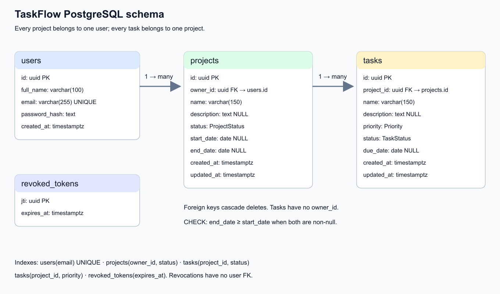
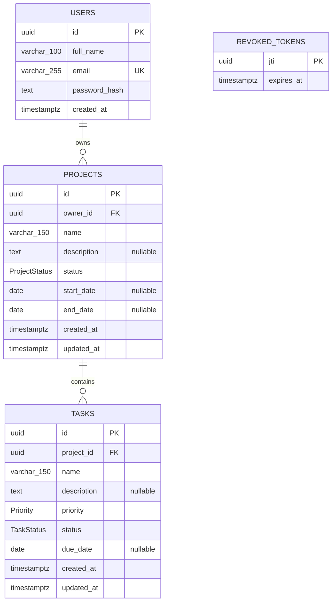

# Database model

Source: backend/prisma/schema.prisma and committed migrations. API serializers
expose camelCase fields; PostgreSQL stores snake_case columns.

ProjectStatus: NOT_STARTED, IN_PROGRESS, COMPLETED. TaskStatus: PENDING,
IN_PROGRESS, COMPLETED. Priority: LOW, MEDIUM, HIGH. Defaults are NOT_STARTED,
PENDING, MEDIUM respectively.

Deleting a user cascades projects; deleting a project cascades tasks. A database
CHECK constraint requires end_date >= start_date when both are non-null. Task
ownership derives from project.owner_id; tasks have no redundant owner column.

Indexes: unique users.email; projects(owner_id,status); tasks(project_id,status);
tasks(project_id,priority); revoked_tokens(expires_at). Prisma generates UUID keys
and maintains project/task updated_at fields. created_at defaults to now.

revoked_tokens stores JWT jti values until expiry with no user foreign key.
Authentication checks revocation before resolving the user. Expired rows are
purged on server startup and hourly.

The PNG is exported from [SVG source](images/er-diagram.svg).
