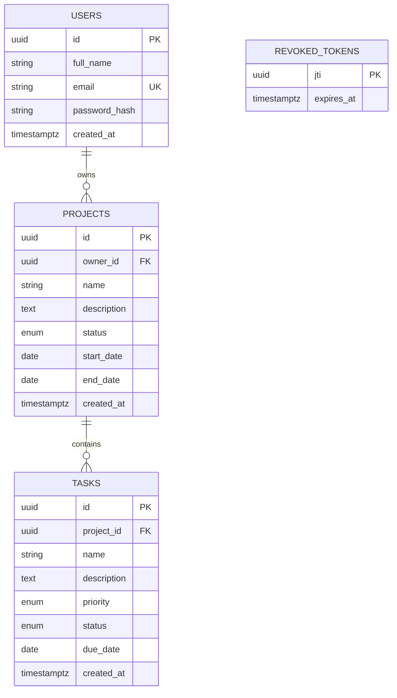

# ER Diagram

```mermaid
erDiagram
  USERS ||--o{ PROJECTS : owns
  PROJECTS ||--o{ TASKS : contains
  USERS { uuid id PK  string full_name  string email UK  string password_hash  timestamptz created_at }
  PROJECTS { uuid id PK  uuid owner_id FK  string name  text description  enum status  date start_date  date end_date  timestamptz created_at }
  TASKS { uuid id PK  uuid project_id FK  string name  text description  enum priority  enum status  date due_date  timestamptz created_at }
  REVOKED_TOKENS { uuid jti PK  timestamptz expires_at }
```
