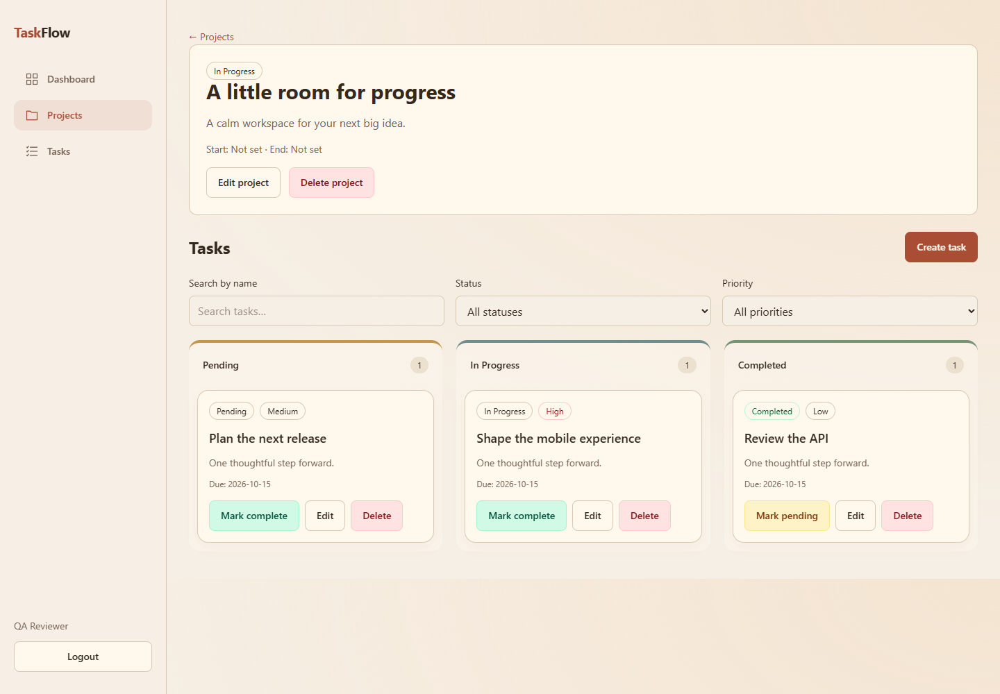
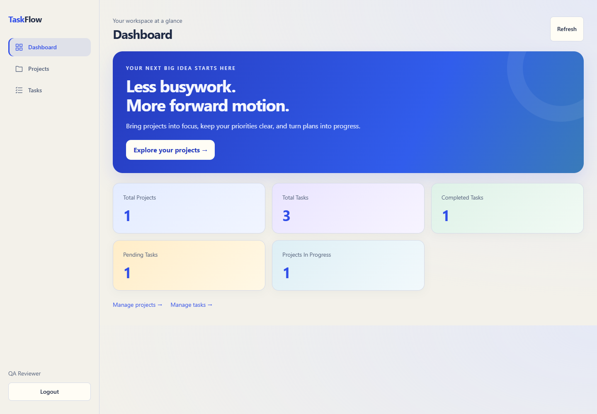
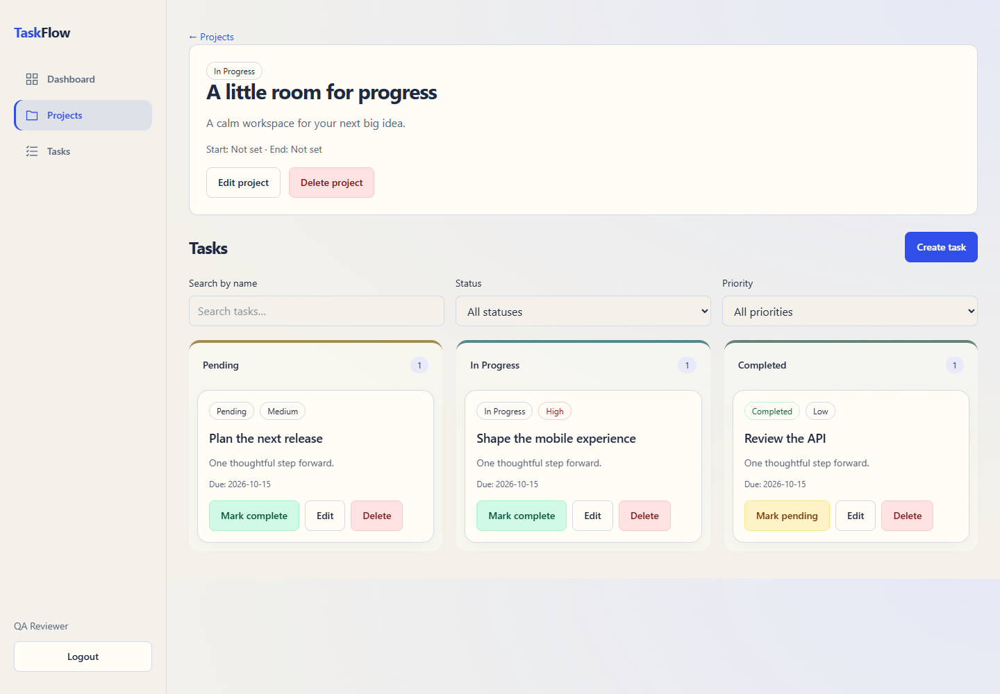

# Application screenshots

Captured on 2026-10-08 from the actual local production web build and local API,
using fictional reviewer data in Neon. These are web screenshots, not Android
screenshots. No JWTs, backend environment values or passwords are visible.

## Web login

## Web dashboard

## Web projects

## Jira-inspired Kanban board

Captured from the deployed Vercel website on 2026-10-08 using temporary fictional demo data, removed after verification. Shows the current sidebar and three status columns.

## Swagger UI

## Android capture pending

## Warm theme update

Captured from the actual local production build on 2026-10-08 with fictional test-database fixtures; shows the newly requested cream/terracotta/sage theme. Reduced-motion and 360px checks pass.

## Android capture instructions

## Professional palette correction

The user rejected the peach appearance. The latest web/mobile palette uses warm stone, ivory, navy and muted teal. Actual local production screenshot (2026-10-08); 360px and reduced-motion browser checks pass.

## Native capture checklist

Once the APK installs, capture dashboard, task list and task form on the Android
phone using the same fictional account. Save those PNGs in docs/images, include
them here and in README, and mark task 8.9 complete after verifying that they show
the actual app. Do not substitute web screenshots at a phone viewport for native
Android screenshots. Hide notifications or personal data before sharing.

## Expressive professional light design (2026-10-08)

Actual Chrome captures; native phone screenshots remain pending.

