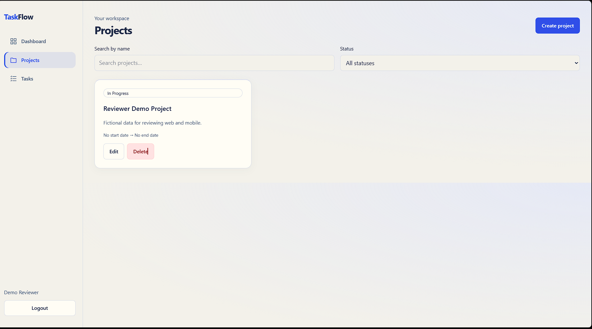
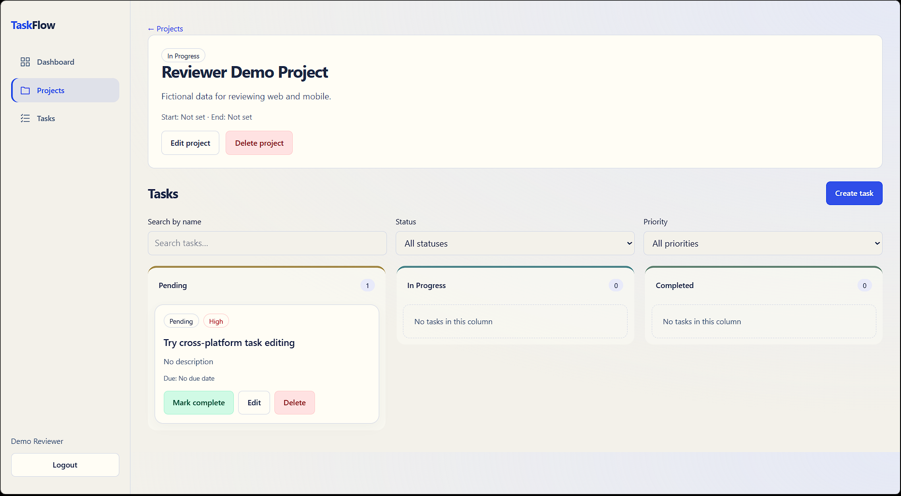
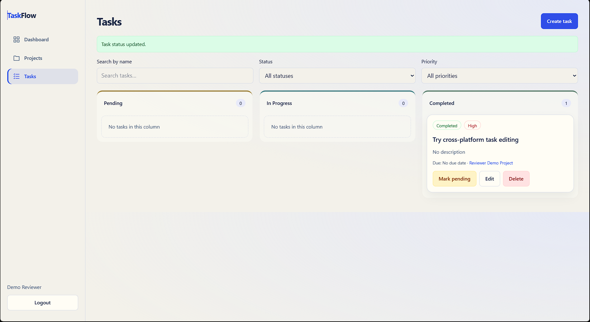
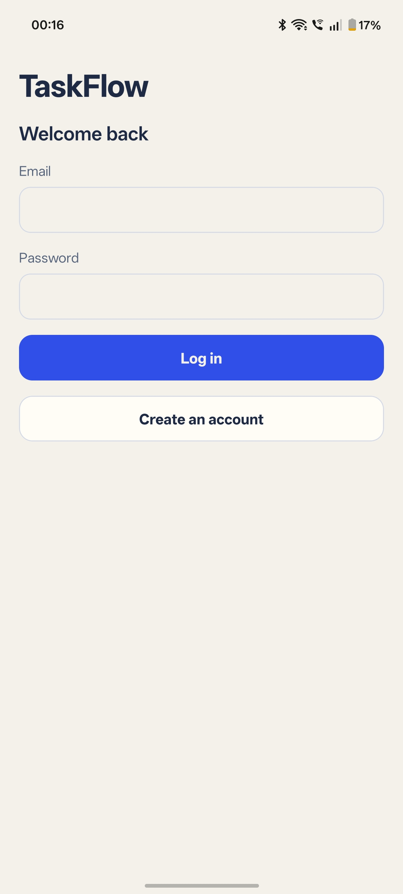
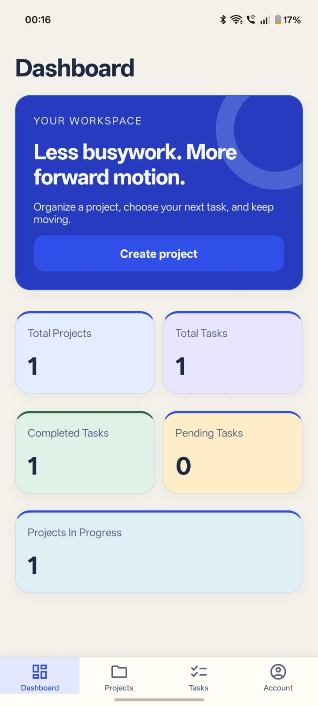
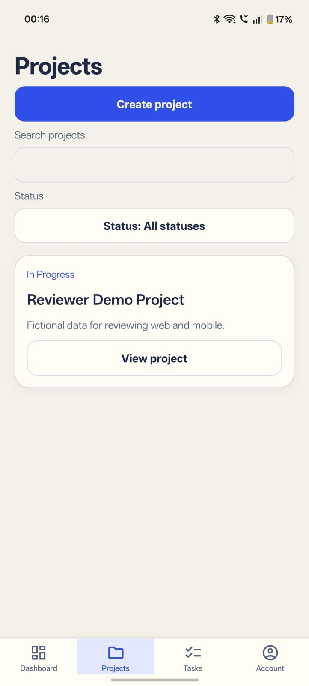
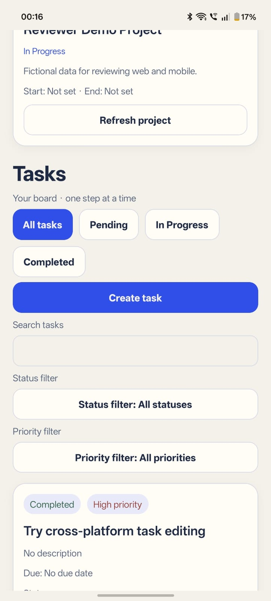
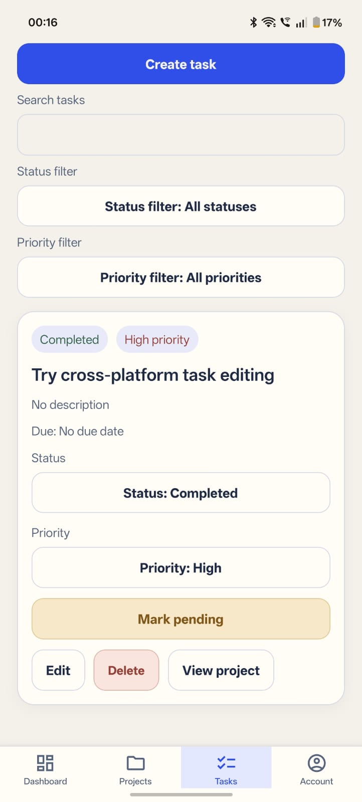

# Application screenshots

Updated 2026-10-09 with the user's supplied screenshots of the deployed website,
showing the current expressive light design and fictional Demo Reviewer data.
These images document web appearance; they do not establish native Android or
cross-platform sync acceptance.

## Web login

## Dashboard

## Projects

## Project details and task board

## Tasks and completion feedback

## Swagger UI

Earlier API documentation capture:

## Native Android screenshots

Supplied by the user on 2026-10-09 from the installed phone app. These show the current light design, tab symbols and fictional reviewer data. Duplicate dashboard capture omitted. Full CRUD, offline, expiry, sync and emulator acceptance remain separate checks.

### Login

### Dashboard and native tab icons

### Projects

### Project details and status tabs

### Completed task and actions

